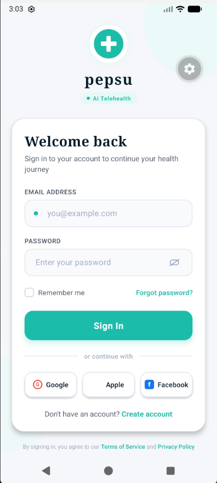

# SignInUI

A clean and modern React Native sign-in screen built with Expo.



## Overview

A minimalist login interface with a calm color palette, smooth form controls, and social sign-in options.

## Features

- Email and password inputs
- Password visibility toggle
- Remember me option
- Social login buttons for Google, Apple, and Facebook
- Simple, card-based layout with soft visual details

## Run locally

```bash
npm install
npm run start
```

Then open the app with your preferred Expo client:

- `npm run android`
- `npm run ios`
- `npm run web`

## Notes

This project is designed to stay simple, easy to read, and visually calm while showcasing a polished sign-in experience.
